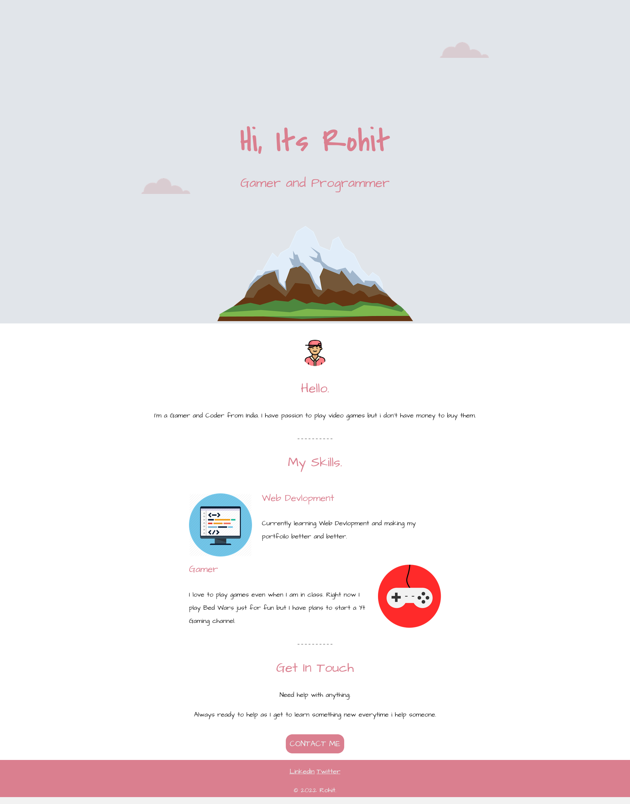

# Basic-portfolio-website-w-bootstrap

- my first website but with bootstrap.
- very basic.
- techonology used: HTML, CSS(Bootstrap).
- preview [here](https://rohit-saini7.github.io/Basic-portfolio-website-w-bootstrap/).

### cleaninig up my laptop so thought uploading this to github will remind me of where I started.

## Screenshot

